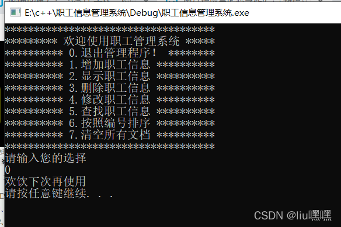

# 职工管理系统

https://blog.csdn.net/weixin_46432435/article/details/124247599

## 1、管理系统需求

职工管理系统可以用来管理公司内所有员工的信息

本教程主要利用C++来实现一个基于多态的职工管理系统


公司中职工分为三类:普通员工、经理、老板，显示信息时，需要显示职工编号、职工姓名、职工岗位、以及职责

普通员工职责:  完成经理交给的任务

经理职责:  完成老板交给的任务，并下发任务给员工

老板职责:  管理公司所有事务


管理系统中需要实现的功能如下:

- 退出管理程序:  退出当前管理系统
- 增加职工信息:  实现批量添加职工功能,将功能信息录入到文件中,职工信息为:职工编号、姓名、部门编号
- 显示职工信息:  显示公司内部所有职工的信息
- 删除离职职工:  按照编号删除指定的职工
- 修改职工信息:  按照编号修改职工个人信息
- 查找职工信息:  按照职工的编号或者职工的姓名进行查找相关的人员信息
- 按照编号排序:  按照职工的编号，进行排序，排序规则由用户指定
- 清空所有文档:  清空文件中记录的所有职工信息(清空前需要确认，防止误删)

运行效果如图：


## 2、创建项目

## 3、创建管理类

管理类负责的内容如下：

- 与用户的沟通菜单界面
- 对职工增删改查的操作
- 与文件的读写交互

### 3.1创建文件

在头文件和源文件的文件下分别创建workerManager.h和workManager.cpp文件

在workManager.h中设计管理类

代码如下：

```cpp
#pragma once // 防止头文件重复包含
#include <iostream>
using namespace std;

class WorkerManager
{
    public:
    //构造函数
    WorkerManager();
    //析构函数
    ~WorkerManager();
};
```

在workerManager.cpp中设计管理类

代码如下：

```cpp
#include "D:\StanLong\git_repository\C\HelloC++\include\workManager.h"

WorkerManager::WorkerManager()
{

}

WorkerManager::~WorkerManager()
{
    
}
```

## 4、菜单功能

功能描述：与用户的沟通界面

### 4.1 添加成员函数

在管理类workerManager.h中添加成员函数 void Show_Menu():

```cpp
// 展示菜单
void Show_Menu();
```

### 4.2 菜单功能实现

在管理类workerManager.cpp中实现Show_Menu()函数

```cpp
#include "D:\StanLong\git_repository\C\HelloC++\include\workManager.h"

WorkerManager::WorkerManager()
{

}

//展示菜单
void WorkerManager::Show_Menu()
{
    cout << "************************************" << endl;
    cout << "********* 欢迎使用职工管理系统 *****" << endl;
    cout << "********** 0.退出管理程序！ ********" << endl;
    cout << "********** 1.增加职工信息 **********" << endl;
    cout << "********** 2.显示职工信息 **********" << endl;
    cout << "********** 3.删除职工信息 **********" << endl;
    cout << "********** 4.修改职工信息 **********" << endl;
    cout << "********** 5.查找职工信息 **********" << endl;
    cout << "********** 6.按照编号排序 **********" << endl;
    cout << "********** 7.清空所有文档 **********" << endl;
    cout << "**********************************" << endl;
}

WorkerManager::~WorkerManager()
{
    
}
```

### 4.3 测试菜单功能

在main.cpp中测试菜单功能

代码：

```cpp
#include <iostream>
#include "D:\StanLong\git_repository\C\HelloC++\include\workManager.h"
#include "D:\StanLong\git_repository\C\HelloC++\src\workerManager.cpp"

int main(int argc, char *argv[])
{
	//实例化管理者对象
    WorkerManager wm;
    //调用展示菜单成员函数
    wm.Show_Menu();
    
    return 0;
}
```

运行效果如图：


## 5、退出功能

### 5.1提供功能接口

在main函数中提供分支选择，提供每个功能接口

代码：

```cpp
#include <iostream>
#include "D:\StanLong\git_repository\C\HelloC++\include\workManager.h"
#include "D:\StanLong\git_repository\C\HelloC++\src\workerManager.cpp"

int main(int argc, char *argv[])
{
	//实例化管理者对象
    WorkerManager wm;
    //调用展示菜单成员函数
    wm.Show_Menu();
    
    int choice=0; // 用来存储用户的选项
    while(true)
    {
        // 调用菜单展示的成员函数
        cout << "请输入您的选择" << endl;
        cin >> choice;
        switch (choice)
        {
            case 0: //退出系统
                wm.ExitSystem();
                break;
            case 1://增加职工
                break;
            case 2://显示职工
                break;
            case 3://删除职工
                break;
            case 4://修改职工
                break;
            case 5://查找职工
                break;
            case 6://排序职工
                break;
            case 7://清空文档
                break;
            default://清屏
                break;
        }
    }
    return 0;
}
```

### 5.2实现退出功能

在workerManager.h中退出系统的成员函数 void ExitSystem();

```cpp
// 退出系统
void ExitSystem();
```

在workerManager.cpp中提供具体的功能实现

代码：

```cpp
void WorkerManager::ExitSystem()
{
    cout << "欢饮下次再使用" << endl;
    system("pause");
    exit(0);//退出程序
}
```

### 5.3测试功能

在main函数分支0选项中，调用退出程序的接口

运行测试截图



## 6、创建职工类

### 6.1创建职工抽象类

职工的分类为： 普通员工、经理、老板

将三种职工抽象到一个类（worker）中，利用多态管理不同职工种类

职工的属性为：职工编号、职工姓名、职工所在部门编号

职工的行为：岗位指责信息描述、获取岗位名称

头文件文件夹下 创建文件worker.h 文件并且添加如下代码：

```cpp
#pragma once
#include<iostream>
using namespace std;
#include<string>

//职工抽象类
class Worker
{
public:
    //显示个人信息
    virtual void showInfo() = 0;
    //获取岗位名称
    virtual string getDeptName() = 0;
    //职工编号
    int m_Id;
    //职工姓名
    string m_Name;
    //部门编号
    int m_DeptId;
};
```

### 6.2创建普通员工类

普通员工类继承职工抽象类，并重写父类中的纯虚函数

在头文件和源文件的文件夹下分别船舰employee.h和employee.cpp文件

employee.h中代码如下：

//普通员工文件
#pragma once
#include <iostream>
using namespace std;
#include "worker.h"
class Employee :public Worker 
{
public:
    //构造函数
    Employee(int id,string name,int dId);
    //显示个人信息
    virtual void showInfo();
    //获取岗位名称
    virtual string getDeptName();

};

employee.cpp中代码如下P:

#include "employee.h"
//构造函数
Employee::Employee(int id, string name, int dId)
{
    this->m_Id = id;
    this->m_Name = name;
    this->m_DeptId = dId;

}
//显示个人信息
void Employee::showInfo()
{
    cout << "职工编号：" << this->m_Id
        << "\t职工姓名" << this->m_Name
        << "\t岗位：" << this->getDeptName()
        << "\t岗位职责：完成经理交给的任务" << endl;
}
//获取岗位名称
string Employee::getDeptName()
{
    return string("员工");
}


测试代码：

#include<iostream>
using namespace std;
#include "workerManager.h"
#include "worker.h"
#include "employee.h"
int main()
{
    //测试代码
    Worker *worker = NULL;
    worker = new Employee(1,"张三",1);
    worker->showInfo();
    //  实例化管理者对象
//  WorkManager wm;
// 
//  int choice = 0;//用来存储用户的选项
//  while(true)
//  {
//    //调用展示菜单成员函数
//  wm.Show_Menu();
//  cout << "请输入您的选择" << endl;
//  cin >> choice;//接受用户的选项
//  switch (choice)
//  {
//  case 0://退出系统
//      wm.ExitSystem();
//      break;
//  case 1://增加职工
//      break;
//  case 2://显示职工
//      break;
//  case 3://删除职工
//      break;
//  case 4://修改职工
//      break;
//  case 5://查找职工
//      break;
//  case 6://排序职工
//      break;
//  case 7://清空文档
//      break;
//  default://清屏
        break;
//  }
//  }
//  
    system("pause");
    return 0;
}


运行效果截图


 

6.3创建经理类
经理类继承职工抽象类，并重写父类中纯虚函数，和普通员工类似

在头文件和源文件的文件夹下分别创建manager.h和manager.cpp文件

manager.h中代码如下：

#pragma  once
#include <iostream>
using namespace std;
#include "worker.h"
//经理类
class Manager :public Worker
{
public:
    //构造函数
    Manager(int id, string name, int dId);
    //显示个人信息
    virtual void showInfo();
    //获取岗位名称
    virtual string getDeptName();
};
manager.cpp中代码如下：

#include "manager.h"
//构造函数
Manager::Manager(int id, string name, int dId)
{
    this->m_Id = id;
    this->m_Name = name;
    this->m_DeptId = dId;
}
//显示个人信息
void Manager::showInfo()
{
    cout << "职工编号：" << this->m_Id
        << "\t职工姓名" << this->m_Name
        << "\t岗位：" << this->getDeptName()
        << "\t岗位职责：完成老板交给的任务，并且下发任务给员工" << endl;
}
//获取岗位名称
string Manager::getDeptName()
{
    return string("经理");
}

6.4创建老板类
老板类继承职工抽象类，并重写父类中的纯虚函数，和普通员工类似

在头文件和源文件的文件夹下分别创建boss.h和boss.cpp文件

boss.h中代码如下：

#pragma  once
#include <iostream>
using namespace std;
#include "worker.h"
//老板类
class Boss :public Worker
{
public:
    //构造函数
   Boss(int id, string name, int dId);
    //显示个人信息
    virtual void showInfo();
    //获取岗位名称
    virtual string getDeptName();
};
boss.cpp中代码如下：

#include "boss.h"
//构造函数
Boss::Boss(int id, string name, int dId)
{
    this->m_Id = id;
    this->m_Name = name;
    this->m_DeptId = dId;
}
//显示个人信息
void Boss::showInfo()
{
    cout << "职工编号：" << this->m_Id
        << "\t职工姓名" << this->m_Name
        << "\t岗位：" << this->getDeptName()
        << "\t岗位职责：管理公司所有事务" << endl;
}
//获取岗位名称
string Boss::getDeptName()
{
    return string("总裁");
}

6.5测试多态
在职工管理系统.cpp中添加测试函数，并且运行能够产生多态

测试代码如下：

#include<iostream>
using namespace std;
#include "workerManager.h"
#include "worker.h"
#include "employee.h"
#include "manager.h"
#include "boss.h"
int main()
{
//测试代码
    Worker *worker = NULL;
    worker = new Employee(1,"张三",1);
    worker->showInfo();
    delete worker;

    worker = new Manager(2, "李四", 2);
    worker->showInfo();
    delete worker;
    
    worker = new Boss(2, "王五", 2);
    worker->showInfo();
    delete worker;
    system("pause");
    return 0;
}

运行效果截图


 

7、添加职工
功能描述： 批量添加职工，并且保存到文件中

7.1功能分析
分析：

用户在批量创建时，可能会创建不同种类的职工

如果向将所有不同种类的员工都放入到一个数组中，可以将所有员工的指针维护到同一个数组里

如果想在程序中维护这个不定长度的数组，可以将数组创建到堆区，并利用Worker**的指针维护


 

7.2功能实现
在WorkerManager.h头文件中添加成员属性 代码：

#pragma  once//防止头文件重复包含
#include <iostream>//包含输入输出流头文件
using namespace std;//使用标准命名空间
#include "worker.h"
#include "employee.h"
#include "manager.h"
#include "boss.h"
class WorkerManager
{
public:
    
    //记录职工人数
    int m_EmpNum;
    
    //职工数组指针
    Worker ** m_EmArray;
    
    //添加职工
    void Add_Emp();

};

在WorkerManager构造函数中初始化属性


WorkerManager::WorkerManager()
{
    //初始化属性
    this->m_EmpNum = 0;

    this->m_EmArray = NULL;
}
//析构函数
WorkerManager::~WorkerManager()
{
    if (this->m_EmArray != NULL)
    {
        delete[] this->m_EmArray;
        this->m_EmArray = NULL;
    }

}

workManager.cpp中实现该函数

//添加职工
void WorkerManager::Add_Emp()
{
	cout << "请输入添加职工数量：" << endl;
	int addNum=0;//保存用户的输入数量
	cin >> addNum;
	if (addNum > 0)
	{
		//添加
		//计算添加空间大小
		int newSize = this->m_EmpNum + addNum;//新空间=原来记录人数+新增人数
	//开辟新空间
		Worker ** newSpace =new Worker*[newSize];
	//将原来空间下数据，拷贝到新空间下
		if (this->m_EmArray != NULL)
		{
			for (int i = 0; i < this->m_EmpNum; i++)
			{
				newSpace[i] = this->m_EmArray[i];
			}
		}
		//批量添加新数据
		for (int i=0;i<addNum;i++)
		{
			int id;//职工编号
			string name;//职工姓名
			int dSelect;//部门选择
			cout << "请输入第" << i + 1 << "个新职工编号：" << endl;
			cin>>id;
			cout << "请输入第" << i + 1 << "个新职工姓名：" << endl;
			cin >> name;
			cout << "请选择该职工岗位：" << endl;
			cout << "1、普通职工" << endl;
			cout << "2、经理" << endl;
			cout << "3、老板" << endl;
			cin >> dSelect;
			Worker * worker = NULL;
			switch (dSelect)
			{
			case 1:
				worker = new Employee(id, name, 1);
				break;
			case 2:
				worker = new Manager(id, name, 2);
				break;
			case 3:
				worker = new Boss(id, name, 3);
			default:
				break;
			}
			//将创建职工职责，保存到数组中
			newSpace[this->m_EmpNum + i] = worker;

		}
		//释放原有空间
		delete[] this->m_EmArray;
	
		//更改新空间指向
		this->m_EmArray = newSpace;
		//更新新的职工人数
		this->m_EmpNum = newSize;
	
		//成功添加后，保存到文件中
		//提示添加成功
		cout << "成功添加" << addNum << "名新职工" << endl;
	}
	else
	{
		//输入有误
		cout << "输入数据有误" << endl;
	}
	//按任意键后，清屏回到上级目录
	system("pause");
	system("cls");
}

7.3测试添加
运行效果：


 

8、文件交互-写文件
功能描述：对文件进行读写

在上一个添加功能中，我们只是将所有的数据台南佳到了内存中，一旦程序结束就无法保存了，因此文件管理类中需要一个与文件进行交互的功能，对于文件进行读写操作

8.1设计文件路径
首先我们将文件路径，在workerManager.h中添加宏常量，并且包含头文件fstream

#include <fstream>
#define  FILENAME "emFIle.txt"

8.2成员函数声明
在workerManager.h中类里添加成员函数 void save();

	//保存文件
	void save();
8.3保存文件功能实现
//保存文件
void WorkerManager::save()
{
	ofstream ofs;
	ofs.open(FILENAME, ios::out);//用输出的方式打开文件--写文件
	//将每个人的数据写入到文件中
	for (int i = 0; i < this->m_EmpNum; i++)
	{
		ofs << this->m_EmArray[i]->m_Id << " "
			<< this->m_EmArray[i]->m_Name << " "
			<< this->m_EmArray[i]->m_DeptId << endl;
	}
	//关闭文件
	ofs.close();

}

8.4保存文件功能测试
	//释放原有空间
		delete[] this->m_EmArray;

		//更改新空间指向
		this->m_EmArray = newSpace;
		//更新新的职工人数
		this->m_EmpNum = newSize;
	
		//成功添加后，保存到文件中
		//提示添加成功
		cout << "成功添加" << addNum << "名新职工" << endl;
		
		//保存数据到文件中
		this->save();
	
	}

再次运行代码，添加职工


 

同级目录下多出文件，并且保存了添加的信息


 

9、文件交互-读文件
功能描述： 将文件中的内容读取到程序中

虽然我们实现了添加职工后保存到文件的操作，但是每次开始运行程序，并没有将文件中数据读取到程序中

而我们的程序功能中还有清空文件的请求

因此狗哦早函数初始化数据的情况分为三种

1、第一次使用，文件未创建

2、文件存在，但是数据被用户清空

3、文件存在，并且保护职工的所有数据

9.1文件未创建
在workerManager.h中添加新的成员属性m_FileEmpty标志文件是否为空

	//判断文件是否为空 标志
	bool m_FileIsEmpty;
修改WorkerManager.cpp中构造函数代码

	ifstream ifs;
	ifs.open(FILENAME, ios::in);//读文件
	
	if (!ifs.is_open())
	{
		cout << "文件不存在" << endl;
		//初始化属性
		//初始化记录人数
		this->m_EmpNum = 0;
		//初始化数组指针
		this->m_EmArray = NULL;
		//初始化文件是否为空
		this->m_FileIsEmpty=true;
		ifs.close();
		return;
	
	}

9.2文件存在且数据为空
在workerManager.cpp中的构造函数追加代码：

//2、文件存在 数据为空
	char ch;
	ifs >> ch;
	if (ifs.eof())
	{
		//文件为空
		cout << "文件为空" << endl;
		//初始化属性
		//初始化记录人数
		this->m_EmpNum = 0;
		//初始化数组指针
		this->m_EmArray = NULL;
		//初始化文件是否为空
		this->m_FileIsEmpty = true;
		ifs.close();
		return;
	}

追加代码位置如图


 

将文件创建后清空文件内容，并测试该情况下初始化功能


 

我们发现文件不存在或者为空，清空m_FilesEmpty 判断文件是否为空的标志都为真，那何时为假？

成功添加职工后，应该更改文件不为空的标志

在void WorkerManager::Add_Emp()成员函数中添加：

//更新职工不为空标志
		this->m_FileIsEmpty = false;
9.3文件存在且保存职工数据
9.3.1获取记录的职工人数

在workerManager.h中添加成员函数 int get_EmpNum();

	//统计文件中人数
	int get_EmpNum();
workerManager.cpp中实现

//统计文件中人数
int WorkerManager::get_EmpNum()
{
	ifstream ifs;
	ifs.open(FILENAME, ios::in);

	int id;
	string name;
	int dId;
	int num = 0;
	while (ifs>>id && ifs>>name && ifs>>dId)
	{
		//统计人数变量
		num++;
	}
	return num;

}

在workerManager.cpp构造函数中继续追加代码

	//3、文件存在，并且记录数据
	int num = this->get_EmpNum();
	cout << "职工人数为 ： " << num << endl;
	this->m_EmpNum = num;
手动添加一些职工数据，测试获取职工数量函数


 

 

9.3.2 初始化数组
根据职工的数据以及职工数量，初始化workerManager中的Worker ** m_EmpArray 指针

在WorkerManager.h中添加成员函数 void intit_Emp();

	//初始化员工
	void init_Emp();
在WorkerManager.cpp中实现

//初始化员工
void WorkerManager::init_Emp()
{
	ifstream ifs;
	ifs.open(FILENAME, ios::in);

	int id;
	string name;
	int dId;
	
	int index = 0;
	while (ifs>>id&&ifs>>name&&ifs>>dId)
	{
		Worker * worker = NULL;
		if (dId == 1)//普通职工
		{
			worker = new Employee(id, name, dId);
	
		}
		else if (dId == 2)//经理
		{
			worker = new Manager(id, name, dId);
	
		}
		else//老板
		{
			worker = new Boss(id, name, dId);
		}
		this->m_EmArray[index] = worker;
		index++;
	}
	//关闭文件
	ifs.close();

}

在workerManager.cpp构造函数中追加代码

	//开辟空间
	this->m_EmArray = new Worker*[this->m_EmpNum];
	//将文件中的数据存到数组中
	this->init_Emp();
	
	//测试代码
	for (int i = 0; i < this->m_EmpNum; i++)
	{
		cout << "职工编号" << this->m_EmArray[i]->m_Id
			<< "姓名：" << this->m_EmArray[i]->m_Name
			<< "部门编号：" << this->m_EmArray[i]->m_DeptId << endl;
	}
运行效果如图


 

10、显示职工
功能描述：显示当前所有职工信息

10.1 显示职工函数声明
在workerManager.h中添加成员函数 void Show_Emp();

	//显示职工
	void Show_Emp();
10.2 显示职工函数实现
在workerManager.cpp中实现成员函数 void Show_Emp();

//显示职工
void WorkerManager::Show_Emp()
{
	//判断文件是否为空
	if (this->m_FileIsEmpty)
	{
		cout << "文件不存在或记录为空!" << endl;
	}
	else
	{
		for (int i = 0; i < m_EmpNum; i++)
		{
			//利用多态调用程序接口
			this->m_EmArray[i]->showInfo();
		}
	}
	//按任意键后清屏
	system("pause");
	system("cls");
}

效果如图：


 

10.3 测试显示职工
case 2://显示职工
	wm.Show_Emp();
测试时分别测试 文件为空和文件不为空两种情况

测试效果

测试1、文件不存在或者违抗情况


 

测试2、文件存在且有记录情况


 

测试完毕，至此，显示所有职工信息功能实现

11、删除职工
11.1删除职工函数声明
在workerManager.h中添加成员函数 void Del_Emp();

	//删除职工
	void Del_Emp();
11.2职工是否存在函数声明
很多功能都需要用到根据职工是否存在进行操作如：删除职工、修改职工、查找职工

因此添加该构造公告函数，以便后续调用

在workerManager.h中添加成员函数 int IsExist(int id);

	//判断职工是否存在  如果存在返回职工所在数组中的位置，不存在返回-1
	int IsExist(int id);
11.3职工是否存在函数实现
在workerManager.cpp中实现成员函数 int IsExist(int id);

//判断职工是否存在  如果存在返回职工所在数组中的位置，不存在返回-1
int WorkerManager::IsExist(int id)
{
	int index = -1;
	for (int i = 0; i < this->m_EmpNum; i++)
	{
		if (this->m_EmArray[i]->m_Id==id)
		{
		
		//找到职工
		index = 1;
		break;
		}
	}
	return index;
}

11.4删除职工函数实现


	//删除职工
void WorkerManager::Del_Emp()
{
	if (this->m_FileIsEmpty)
	{
		cout << "请输入想要删除职工编号：" << endl;
		int id = 0;
		cin >> id;

     int index = this->IsExist(id);
    if (index !=-1) //说明职工存在，并且要删除掉index位置上的职工
    {
    	for (int i=index;i<this->m_EmpNum-1;i++)
    	{
    
    	//数据前移
    	this->m_EmArray[i] = this->m_EmArray[i + 1];
    
        }
    	this->m_EmpNum--;//更新数组中记录人员个数
    	//同步更新到文件中
    	this->save();
    	cout << "删除成功" << endl;
    }
    else
    {
    	cout << "删除失败，未找到该职工" << endl;
    }
}
//按任意键清屏
system("pause");
system("cls");
}

11.5测试删除职工
case 3://删除职工
// 	{	
// 		//测试
// 
// 		int ret = wm.IsExist(8);
// 	if (ret != -1)
// 	{
// 		cout << "职工存在" << endl;
// 	}
// 	else
// 	{
// 		cout << "职工不存在" << endl;
// 	}
		wm.Del_Emp();
		break;
测试1、删除不存在职工情况


 

测试2、删除存在职工情况


 

再次显示所有职工信息，确保已经删除


 

查看文件中信息，再次核实员工已被完全删除


 

12、修改职工
功能描述：能够按照职工的编号对职工信息进行修改并保存

12.1修改职工函数声明
在workerManager.h中添加成员函数 void Mod_Emp();

	//修改员工
	void Mod_Emp();
12.2修改职工函数实现
在workerManager.cpp中实现成员函数 void Mod_Emp();

//修改员工
void WorkerManager::Mod_Emp()
{
	if (this ->m_FileIsEmpty)
	{
		cout << "文件不存在或记录为空！" << endl;
	}
	else
	{
		cout << "请输入修改职工的编号：" << endl;
		int id;
		cin >> id;
		int ret = this->IsExist(id);
		if (ret != -1)
		{
			//查找到编号的职工
			delete this->m_EmArray[ret];
			int newId = 0;
			string newName = "";
			int dSelect = 0;

			cout << "查到 ；" << id << "号职工，请输入新职工号：" << endl;
			cin >> newId;
			cout << "请输入新姓名：" << endl;
			cin >> newName;
			cout << "请输入岗位" << endl;
			cout << "1、普通岗位" << endl;
			cout << "2、经理" << endl;
			cout << "3、老板" << endl;
			cin >> dSelect;
	
			Worker *worker = NULL;
			switch (dSelect)
			{
			case 1:
				worker = new Employee(newId, newName, dSelect);
				break;
			case 2:
				worker = new Manager(newId, newName, dSelect);
				break;
			case 3:
				worker = new Boss(newId, newName, dSelect);
				break;
			default:
				break;
			}
			//更新数据 到数组中
			this->m_EmArray[ret] = worker;
			cout << "修改成功" << endl;
			//保存到文件中
			this->save();
	
		}
		else
		{
			cout << "修改失败,查无此人" << endl;
		}
	}
	system("pause");
	system("cls");

}

测试：

无此人：


 

13、查找职工
功能描述：提供两种查找职工方式，一种按照职工编号，一种按照职工姓名

13.1 查找职工函数声明
在workerManager.h中添加成员函数 void Find_Emp();

	//查找职工
	void Find_Emp();
13.2查找职工函数实现
在workerManager.cpp中实现成员函数 void Find_Emp();

//查找职工
void WorkerManager::Find_Emp()
{
	if (this->m_FileIsEmpty)
	{
		cout << "文件不存在或记录为空" << endl;
	}
	else {
		cout << "请输入查找的方式：" << endl;
		cout << "1、按照职工编号查找" << endl;
		cout << "2、按照姓名查找" << endl;
	
		int select = 0;
		cin >> select;
	
		if (select == 1)
		{
			//按照编号查
			int id;
			cout << "请输入查找的职工编号：" << endl;
			cin >> id;
			int ret = IsExist(id);
			if (ret != -1)
			{
				//找到职工
				cout << "查找成功！该职工信息如下：" << endl;
				this->m_EmArray[ret]->showInfo();
			}
			else
			{
				cout << "查找失败，查无此人" << endl;
			}
	
		}
		else if (select == 2)
	    {
			//按照姓名查
			string name;
			cout << "请输入查找的姓名：" << endl;
			cin >> name;
	
			//介入判断是否查到的标志
			bool flag = false;//默认未找到职工
	
			for (int i = 0; i < m_EmpNum; i++)
			{
				if (this->m_EmArray[i]->m_Name == name)
				{
					cout << "查找成功，职工编号为："
						<< this->m_EmArray[i]->m_Id 
						<< "号职工信息如下：" << endl;
					flag = true;
				//调用显示信息接口
				this->m_EmArray[i]->showInfo();
			}
			}
			if (flag == false)
			{
				cout << "查找失败，查无此人！" << endl;
			}
		}
		else
		{
			cout << "输入选项有误" << endl;
		}
	}
	//按任意键清屏
		system("pause");
		system("cls");

}

13.3测试查找职工

case 5://查找职工
	wm.Find_Emp();
	break;
1.按编号


 

2、按姓名


 

14、排序
功能描述：按照职工编号进行排序，排序的顺序由用户指定

14.1排序函数声明

在workerManager.h中添加成员函数 void Sort_Emp();

	//按照编号排序
	void Sort_Emp();
14.2 排序函数实现

在workerManager.cpp中实现成员函数 void Sort_Emp();

//按照编号排序
void WorkerManager::Sort_Emp()
{
	if (this->m_FileIsEmpty)
	{
		cout << "文件不存在或记录为空" << endl;
		system("pause");
		system("cls");
	}
	else
	{
		cout << "请输入排序方式：" << endl;
		cout << "1、按照工号进行升序" << endl;
		cout << "2、按照工号进行降序" << endl;
		int select = 0;
		cin >> select;


		for (int i = 0; i < m_EmpNum; i++)
		{
			int minOrMax = i;//声明最小值或最大值下标
			for (int j = i + 1; j < this->m_EmpNum; j++)
			{
				if (select == 1)//升序
				{
					if (this->m_EmArray[minOrMax]->m_Id>this->m_EmArray[j]->m_Id)
					{
						minOrMax = j;
					}
				}
	
				else//降序
				{
					if (this->m_EmArray[minOrMax]->m_Id < this->m_EmArray[j]->m_Id)
					{
						minOrMax = j;
					}
				}
			}
			//判断一开始认定 最小值或最大值 是不是计算的最大值或最小值 ，如果不是 交换数据
			if (i != minOrMax)
			{
				Worker * temp = this->m_EmArray[i];
				this->m_EmArray[i] = this->m_EmArray[minOrMax];
				this->m_EmArray[minOrMax] = temp;
			}
		}
		cout << "排序成功！排序后的结果为：" << endl;
		this->save();//排序后结果保存到文件中
		this->Show_Emp();//展示所有职工
	}

}

测试：

case 6://排序职工
	wm.Sort_Emp();
	break;
升序：


 

 

降序：


 

 

15、清空文件
功能描述：将文件记录数据清空

15.1 清空函数声明
在workerManager.h中添加成员函数 void Clean_File();

	//清空文件操作
	void Clean_File();
15.2清空函数实现
在workerManager.cpp中实现成员函数 void Clean_File();

//清空文件操作
void WorkerManager::Clean_File()
{
	cout << "确定清空？" << endl;
	cout << "1、确定" << endl;
	cout << "2、返回" << endl;

	int select = 0;
	cin >> select;
	if (select == 1)
	{
		//清空文件
		ofstream ofs(FILENAME, ios::trunc);//删除文件后重新创建
		ofs.close();
		if (this->m_EmArray != NULL)
		{
//删除堆区的每个职工对象
			for (int i=0;i<this->m_EmpNum;i++)
			{
				delete this->m_EmArray[i];
				this->m_EmArray[i] = NULL;
			}
			//删除堆区数组指针
			delete[] this->m_EmArray;
			this->m_EmArray = NULL;
			this->m_EmpNum = 0;
			this->m_FileIsEmpty = true;
		}
		cout << "清空成功！" << endl;
	}
	system("pause");
	system("cls");
}

15.3 测试清空文件
在main函数分支7选项中，调用清空文件窗口

case 7://清空文档
	wm.Clean_File();
	break;
default://清屏
	system("cls");
	break;
测试确认清空文件


 

再次查看文件中数据，记录已空


 

打开文件，里面数据已确保清空，该功能需要慎用


 

随着文件功能实现，本案例制作完毕~
————————————————
版权声明：本文为CSDN博主「liu嘿嘿」的原创文章，遵循CC 4.0 BY-SA版权协议，转载请附上原文出处链接及本声明。
原文链接：https://blog.csdn.net/weixin_46432435/article/details/124247599