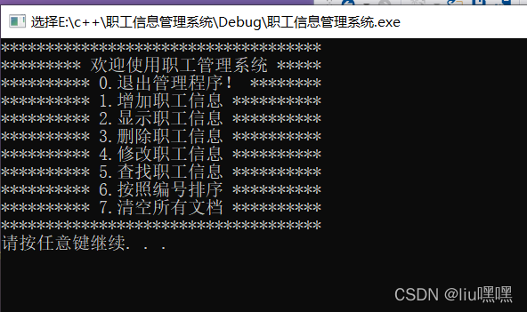

# 职工管理系统

## 1、管理系统需求

职工管理系统可以用来管理公司内所有员工的信息

本教程主要利用C++来实现一个基于多态的职工管理系统


公司中职工分为三类:普通员工、经理、老板，显示信息时，需要显示职工编号、职工姓名、职工岗位、以及职责

普通员工职责:  完成经理交给的任务

经理职责:  完成老板交给的任务，并下发任务给员工

老板职责:  管理公司所有事务


管理系统中需要实现的功能如下:

- 退出管理程序:  退出当前管理系统
- 增加职工信息:  实现批量添加职工功能,将功能信息录入到文件中,职工信息为:职工编号、姓名、部门编号
- 显示职工信息:  显示公司内部所有职工的信息
- 删除离职职工:  按照编号删除指定的职工
- 修改职工信息:  按照编号修改职工个人信息
- 查找职工信息:  按照职工的编号或者职工的姓名进行查找相关的人员信息
- 按照编号排序:  按照职工的编号，进行排序，排序规则由用户指定
- 清空所有文档:  清空文件中记录的所有职工信息(清空前需要确认，防止误删)

运行效果如图：



## 2、创建项目

## 3、创建管理类

管理类负责的内容如下：

- 与用户的沟通菜单界面
- 对职工增删改查的操作
- 与文件的读写交互

### 3.1创建文件

在头文件和源文件的文件下分别创建workerManager.h和workManager.cpp文件

在workManager.h中设计管理类

代码如下：

```cpp
#pragma once // 防止头文件重复包含
#include <iostream>
using namespace std;

class WorkerManager
{
    public:
    //构造函数
    WorkerManager();
    //析构函数
    ~WorkerManager();
};
```

在workerManager.cpp中设计管理类

代码如下：

```cpp
#include "workManager.h"

WorkerManager::WorkerManager()
{

}

WorkerManager::~WorkerManager()
{
    
}
```

# 4、菜单功能

功能描述：与用户的沟通界面

## 4.1 添加成员函数

在管理类workerManager.h中添加成员函数 void Show_Menu():