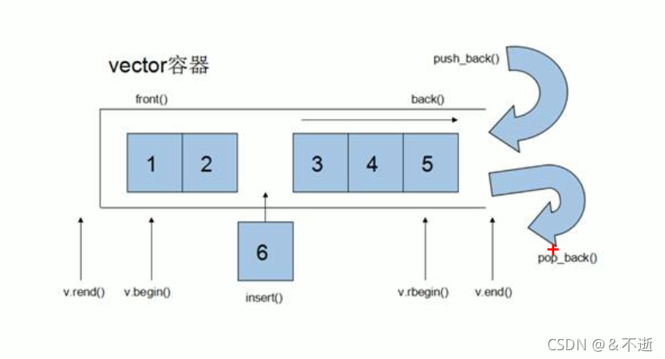

# vector 容器

## 1.1 基本概念

**功能：**vector 数据结构和数组非常相似，也称为单端数组

**vector与普通数组的区别：**数组是静态空间，vector可以动态扩展

**动态扩展：**动态扩展并不是在原有的空间之后续接新空间，而是找更大的内存空间，然后将原数据拷贝到新空间，释放原空间



## 1.2 构造函数

构造函数原型

```cpp
vector<T> v ; //使用模板类，默认构造函数
vector(v.begin(),v.end()); //将[v.begin(),v.end())区间中的元素拷贝给本身
vextor(n,elem); //将n个elem拷贝给本身
vector(const vector &v) ; //拷贝构造函数
```

```cpp
#include<iostream>
using namespace std;
#include <vector>
#include <algorithm> // 标准算法头文件

// vector 容器

void printVector(vector<int> &v)
{
	for(vector<int>::iterator it = v.begin(); it!=v.end(); it++)
	{
		cout<< *it << "";
	}
	cout << endl;
}

void test01()
{
    vector<int> v1; // 默认构造，无参构造
	for(int i=0; i<10; i++)
	{
		v1.push_back(i);
	}
	printVector(v1);

	// 通过区间的方式进行构造
	vector<int> v2(v1.begin(), v1.end());
	printVector(v2);

	// n 个 elem 方式构造
	vector<int> v3(10, 100); // 10 个 100
	printVector(v3);

	// 拷贝构造
	vector<int> v4(v3);
	printVector(v4);
	
}

int main()
{
    test01();
}
```


